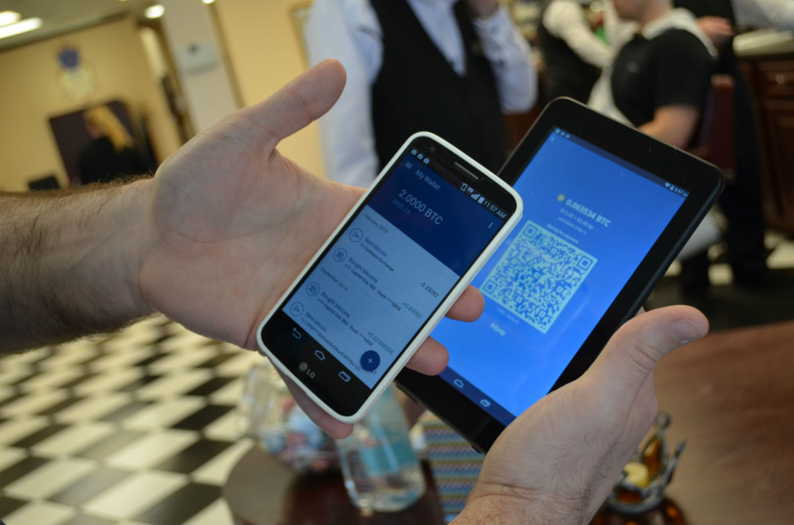
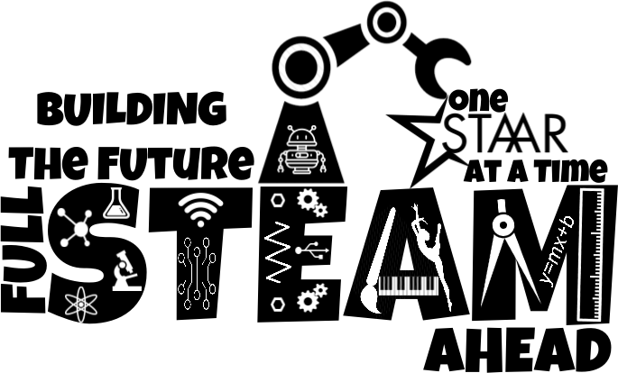
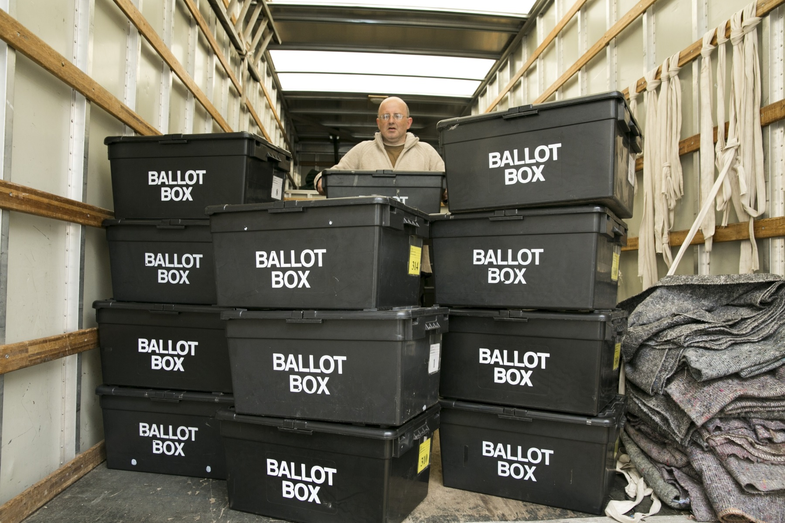
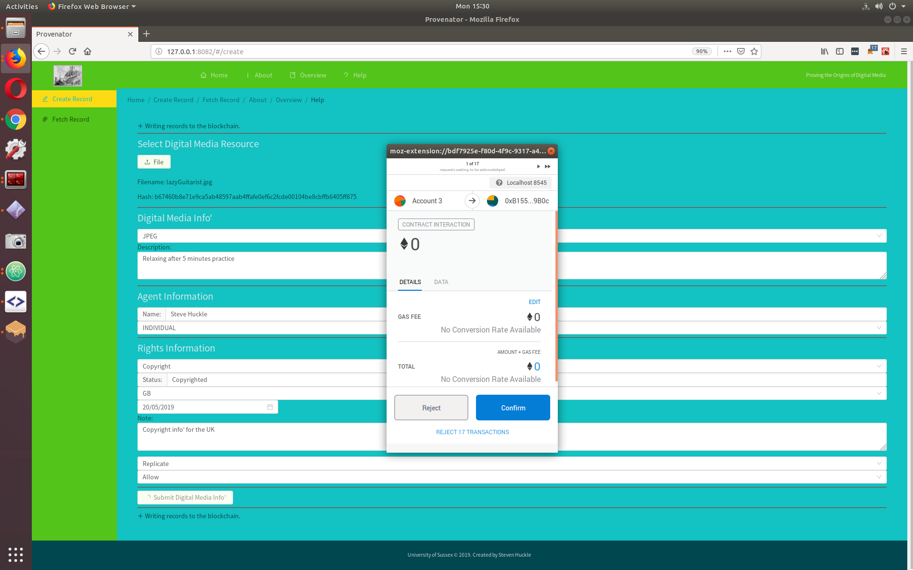
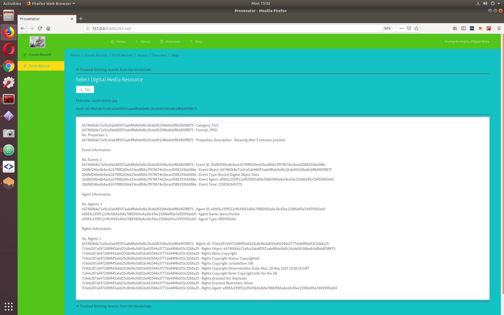
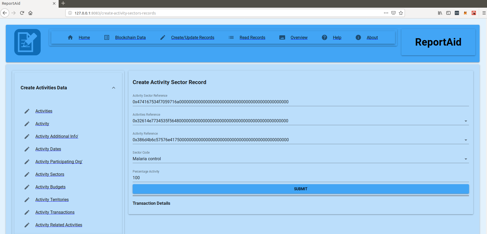
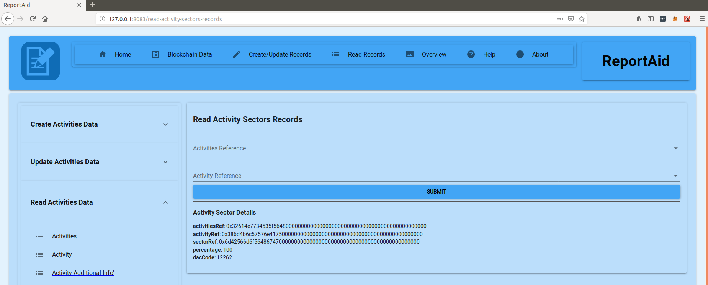
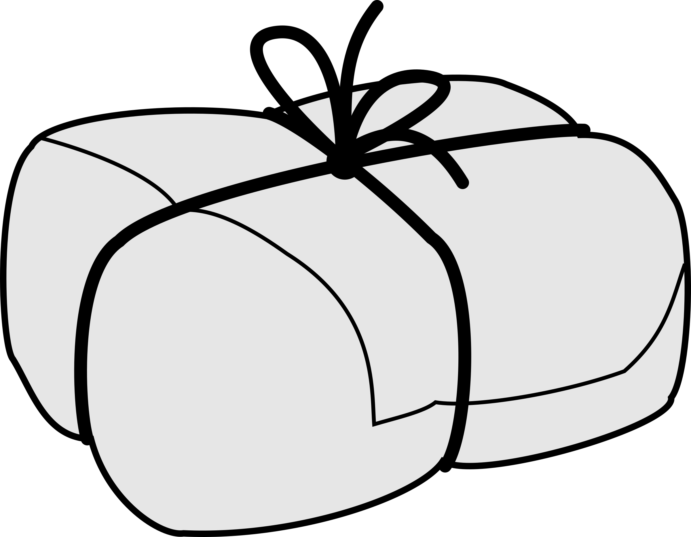

# Beyond CryptoCurrencies

by Steve Huckle - steve.huckle@gmail.com

--------------------------------------------------------------------------------

## Objectives

- Provide an overview of my work at Sussex
- Introduce the three applications (MVPs) I've created there
- Discuss blockchain collaboration

## Table of Contents

- Me
- My research
- [MicroMorpher](https://github.com/glowkeeper/Micromorpher), [Provenator](https://github.com/glowkeeper/Provenator) and [ReportAid](https://github.com/glowkeeper/ReportAid)
- My conclusions

# Me

by Steve Huckle - steve.huckle@gmail.com

--------------------------------------------------------------------------------

## Background

- 25+ Years in IT
- Trainee Cobol Programmer
- BSc Computer Science
- UNIX Sys' Admin'
- MSc Music Technology

## Background (cont'd)

- Audio Programmer in games
- Freelance Programmer
- MSc Energy and the Environment
- [Bitcoin](https://bitcoin.org/en/) mining
- PhD in Blockchain Technologies at the [University of Sussex](https://www.sussex.ac.uk/)

# My Research

_Source: [Open Clip Art](https://openclipart.org/detail/271913/full-steam)_

--------------------------------------------------------------------------------

## My Research Question

_Are blockchains how we can collaborate?_

## Premise

Yochai Benkler, writing at the dawn of the present century, remarked:

"An open, free, flat, peer-to-peer network best serves the ability of anyone – individual, small group, or large group – to come together to build our information environment. It is through such open and equal participation that we will best secure both robust democratic discourse and individual expressive freedom"

Do blockchains represent our best chance for such an Egalitarian Society?

## Approach

**Design Science Research** (DSR) focuses on achieving understanding by building _artefacts_ that satisfy a set of functional requirements.

Although the creation of artefacts is critical, they are not the goal of DSR; instead, the focus is acquiring understanding.

## Publications

- [Internet of Things, Blockchain and Shared Economy Applications](http://dx.doi.org/10.1016/j.procs.2016.09.074)
- [Socialism and the Blockchain](http://dx.doi.org/10.3390/fi8040049)
- [Towards a post-cash society: An application to convert fiat money into a cryptocurrency](http://dx.doi.org/10.5210/fm.v22i3.7410)
- [Fake News - a Technological Approach to Proving Provenance Using Blockchains](https://doi.org/10.1089/big.2017.0071)

## Artefacts

My artefacts demonstrate collaboration through tokenisation ([MicroMorpher](https://github.com/glowkeeper/Micromorpher)), provenance ([Provenator](https://github.com/glowkeeper/Provenator)) and humanitarian aid reporting ([ReportAid](https://github.com/glowkeeper/ReportAid)).

# MicroMorpher

--------------------------------------------------------------------------------

## Towards a PostCash Society

My article, [Towards a post-cash society: An application to convert fiat money into a cryptocurrency](http://dx.doi.org/10.5210/fm.v22i3.7410), discusses whether a blockchain-based tool, such as [MicroMorpher](https://github.com/glowkeeper/Micromorpher), might have helped the Indian government's 'demonitisation' process, which was legislation to remove 500 and 1,000 Rupee banknotes from circulation.

## Exchange Rates

## Exchanging Fiat for Cryptos

## Future Improvements

Distributed currency exchange, using [Ox protocol](https://0xproject.com/)?

But I reckon I have a better idea for a token exchange application - _betfair.crypto_

# Provenator

_Source: Birmingham Mail_

--------------------------------------------------------------------------------

## Fake News

My article, [Fake News - a Technological Approach to Proving Provenance Using Blockchains](https://doi.org/10.1089/big.2017.0071), describes a photo that a prominent supporter of Donald Trump claimed showed the Clinton Campaign doctoring votes. The New York Times went to great lengths to prove the picture was fake; I create a scenario where the paper is saved a lot of bother because the photographer uses my blockchain app', [Provenator](https://github.com/glowkeeper/Provenator), to establish the origins of her snap.

## A Photograph Where Rights Need Establishing

## Creating a Provenance Record

## Establishing Provenance

## Future Improvements

Perceptual Hashing?

# ReportAid

_Source: <https://iatistandard.org/en/>_

--------------------------------------------------------------------------------

## The Transparency of Humanitarian Aid

At the 2016 World Humanitarian Summit, large humanitarian donors and aid organisations agreed to a "Grand Bargain" (GB) to improve the lives of people living in fragile situations because of crises.

The GB made many commitments, including enhancing the **transparency** of mutual aid reporting, thereby strengthening accountability, helping decision-making and ultimately, improving the effectiveness of humanitarian efforts.

## International Aid Transparency Initiative

The Grand Bargain adopted the International Aid Transparency Initiative (IATI) as its standard open-data format for documenting aid finance.

## Three Aspects of Transparency

A report following the Grand Bargain established the 3Ts of transparency:

1. **Traceability**. The entire transaction chain of aid data must be traceable.
2. **Totality**. Financial information must be complete and relevant.
3. **Timeliness**. Aid information should be up-to-date

## A Need for Transparency

Evidence from the U.K. suggests that transparency is necessary. The amount of humanitarian financing contributed by the U.K. is a result of the official development assistance target of 0.7% of gross national income. In 2015, that amounted to the U.K. spending £12.1bn. That degree of funding has received much criticism. For instance, while giving evidence to a U.S. Senate Committee on foreign relations, ex-UK Prime Minister David Cameron said this:

_If what we do is just have continued programs for countries that sometimes fail year after year after year, we just keep going, maybe that's not a good use of our money_

## Four Aspects of Transparency

However, did the Grand Bargain report miss a 'T' of transparency?

**Trust** adds an indispensable quality to aid reporting; in this context, it means donors trusting that the reports contain information that is traceable, total and timely.

1. **Traceability**.
2. **Totality**.
3. **Timeliness**.
4. **Trustworthiness**.

## Trust

Hence, a proposal of my thesis is that blockchain technology adds **trust** when reporting humanitarian aid financing, thus helping to negate criticisms, such as those made above by Mr Cameron.

## Blockchain Implementation of the IATI Standard

[ReportAid](https://github.com/glowkeeper/ReportAid) is an MVP that implements the IATI standard and demonstrates blockchain's capability for addressing the 4Ts of transparency.

## Writing Humanitarian Sectors

## Reading Humanitarian Sectors

## Future Improvements

[ReportAid](https://github.com/glowkeeper/ReportAid) only supports part of the IATI activity standard.

# Wrapping Up

_Source: [Open Clipart](https://openclipart.org/detail/220024/parcel-bw)_

--------------------------------------------------------------------------------

## Conclusions

> - [MicroMorpher](https://github.com/glowkeeper/Micromorpher), [Provenator](https://github.com/glowkeeper/Provenator) and [ReportAid](https://github.com/glowkeeper/ReportAid) demonstrate that blockchains are the _technical_ means by which we can freely collaborate
> - The key to that is **TRUST**
> - However...

## Conclusions (cont'd)

> - My thesis also discusses significant barriers towards blockchain's wide-scale adoption
> - Not least of which is that blockchain's flat (non-hierarchical) architecture is not necessarily how (Capitalist) Society organises itself

## Future Work

> - Commons-based peer production and blockchain governance
> - My article for [The Conversation](https://theconversation.com/uk) looks at [Bitcoin Energy Consumption](http://theconversation.com/bitcoins-high-energy-consumption-is-a-concern-but-it-may-be-a-price-worth-paying-106282), a concern I raised in my paper, [Socialism and the Blockchain](http://dx.doi.org/10.3390/fi8040049). How can that be solved?

## Appendix I

- Please Watch, Star, Fork <https://github.com/glowkeeper/Micromorpher>, <https://github.com/glowkeeper/Provenator> and <https://github.com/glowkeeper/ReportAid>
- Support open source! Open data! Open standards in general!

## Appendix II

This presentation may be downloaded via <https://github.com/glowkeeper/blockchainMeetup>.

- The presentation is just HTML5, so it runs in a browser.
- It was produced with open source tools, including [Atom](https://atom.io/), [Pandoc](https://pandoc.org/) and [reveal.js](https://github.com/hakimel/reveal.js/ "reveal.js"), as well as an open source markup language, [Markdown](https://daringfireball.net/projects/markdown/).

# Thank You

Steve Huckle - steve.huckle@gmail.com - [https://glowkeeper.github.io](https://glowkeeper.github.io/)
